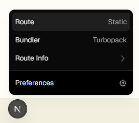

- Những khái niệm đã hiểu.
    + Commit project vào local repo rồi nhưng chưa push lên remote repo, mới chỉ lưu trên máy tính của mình.
    + Đã hiểu chút về Next.js như là framework của React.js, như là một cái khung sườn để xây dựng web app. Cần cài Node.js và npm để chạy Next.js.
    + Chạy lệnh npx create-next-app@latest để tạo project Next.js. Lệnh này sẽ tạo ra một thư mục chứa code của project. 

- Những khái niệm còn mơ hồ.
    + Nút  để làm gì?